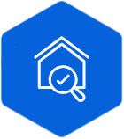

<!-- logo -->

## 부동산 중개의 새로운 기준, 중개모아 

## 일부 기능 시연 영상

### - 대시보드

### - 매물

### - 상담

## 프로젝트 설명

**2025년 3월 17일 ~ 2025년 5월 16일**

**중개모아**는 공인중개사를 위한 통합 부동산 CRM 솔루션으로, 단순한 매물 및 단지 정보 수집을 넘어서 **중개 실무의 전 과정을 효율화하고 자동화**하여 **공인중개사의 업무 생산성**과 **고객 만족도**를
높이는 것을 목표로 만들어졌습니다.

## 주요 기능

### 대시보드

전체 통계(매물 유형, 거래 병), 주요 알림, 만료 예정 계약 등

### 매물 관리

지도 기반 매물 목록 조회/검색

### 고객 관리

고객 프로필 및 연락처 관리, 상담, 계약,메시지, 설문 히스토리 확인

### 상담 관리

상담 일정 등록 및 알림, 상담 히스토리 기반 상담 작성

### 설문 관리

설문 템플릿 생성, url 추출, 응답 수

### 문자 관리

대량 문자 발송, 문자 발송 예약, 발송 이력 확인

### 문의 게시판

질문 작성/답변, 챗봇을 통한 자동 질문 응답, 답변을 통한 상담 신청

## Tech Stack

### Backend

### Infrastructure

### DevOps / Monitoring

### Additional

## 프로젝트 아키텍처

## 팀원

|                       권승목 ([Seungmok1](https://github.com/Seungmok1))                        |                      허용석 ([missiletoe](https://github.com/missiletoe))                       |                            정소현 ([sohyeonjung](https://github.com/sohyeonjung))                            |
|:--------------------------------------------------------------------------------------------:|:--------------------------------------------------------------------------------------------:|:---------------------------------------------------------------------------------------------------------:|
|  |  |               |
|            Message, Agent API 구현, 부하 테스트 및 성능 모니터링, Spring Security, Spring batch            |                              Article API 구현, 매물 크롤링 및 지도 화면 구현                               | Consultation, Contract, Customer, Inquiry, Survey, Notification API 구현, Logging, 인프라 구축(무중단 배포, CI/CD 설계) |

