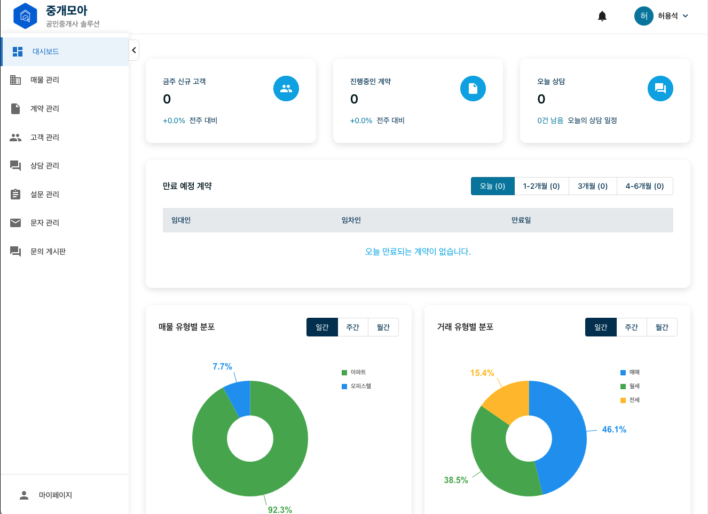

# 부동산 중개의 새로운 기준, 중개모아 



## 1. 서비스 개요

**중개모아**는 공인중개사를 위한 통합 부동산 CRM 솔루션입니다. 단순한 매물 및 단지 정보 수집을 넘어서, 중개 실무의 전 과정을 효율화하고 자동화하여 공인중개사의 업무 생산성과 고객 만족도를 극대화하는 것을 목표로 합니다.

본 서비스는 다음과 같은 기능적 범위를 포함합니다:

- **매물 및 단지 통합 수집 및 관리**: 네이버부동산, 직방 등 주요 플랫폼의 데이터를 자동 수집하여 단일 인터페이스에서 관리할 수 있도록 통합 처리합니다. Hibernate Spatial을 활용해 공간 기반 클러스터링 및 위치 필터링 기능도 제공합니다.

- **공인중개사 중심 계약 관리**: 임차인과 임대인 간의 계약서를 생성, 편집, PDF 저장하며 계약 상태(진행 중, 완료, 갱신 등)를 실시간으로 추적하고 관리할 수 있습니다.

- **고객 데이터 통합 및 상담 관리**: 다양한 채널(네이버 부동산과 직방)에서 유입되는 고객 데이터를 수집, 통합하며 상담 이력과 통화 내역을 기록하고 시각화된 대시보드로 제공합니다. 엑셀 업로드, 라벨링, 필터링 기능도 포함됩니다.

- **자동화 문자 발송 기능**: 고객 생일, 계약 만료일, 기념일 등 주요 이벤트를 기준으로 자동 문자를 발송할 수 있으며, 템플릿 설정, 예약 발송, 실패 리포트 기능을 지원합니다.

- **신규 고객 유입 설문 프로세스**: 공인중개사가 QR코드 또는 고유 URL을 활용해 설문지 기반 상담 요청을 받을 수 있으며, 다중 문항 유형(객관식/주관식/파일 업로드 포함)과 통계 리포트를 통해 고객을 분류하고 상담 준비도를 향상시킬 수 있습니다.

- **단체 문자 발송**: 등록된 고객 데이터를 필터링하여 템플릿 기반 대량 문자를 발송할 수 있으며, 발송 성공률, 통계, 실패 건 리포트 등을 실시간으로 확인할 수 있습니다.

- **문의 게시판 및 커뮤니케이션 허브**: 고객이 직접 남긴 질문에 답변하고, 파일 첨부, 댓글, 좋아요 기능을 통해 쌍방향 커뮤니케이션을 제공합니다.

- **기타 중개업무 지원 기능**: 회원가입, 로그인, 권한 관리(RBAC), 마이페이지(개인정보 수정, 알림 설정), 상담 일정 등록, 상담사 지정 등의 부가 기능도 포함됩니다.

이러한 기능은 React 기반 직관적인 프론트엔드 UI와 Spring Boot 기반의 견고한 백엔드 아키텍처를 통해 유기적으로 동작하며, 공인중개사가 데이터를 기반으로 시장을 선도할 수 있도록 돕습니다.

## 2. 주요 기능
### 2.1 공통 기능
- 회원가입(Sign Up), 로그인(Sign In), 비밀번호 재설정, 권한 관리(RBAC)
- 마이페이지(개인정보 조회/수정, 알림 설정)

### 2.2 대시보드
- 전체 통계(매물, 단지, 회원 수)
- 실시간 스크래핑 상태 모니터링
- 주요 알림 배너

### 2.3 매물 관리
- 매물 목록 조회/검색
- 상세 정보 편집(가격, 면적, 위치)
- 상태 변경(활성/비활성)

### 2.4 단지 관리
- 단지 목록 조회
- 중복 단지 병합 및 관리
- 행정동/지오해시 기반 클러스터링

### 2.5 계약 관리
- 계약서 작성 및 저장(PDF)
- 계약 상태 추적(진행, 완료, 갱신)
- 알림(만료 예정 알림)

### 2.6 고객 관리
- 고객 프로필 및 연락처 관리
- 문의/상담 이력 조회

### 2.7 상담 관리
- 상담 일정 등록 및 알림
- 상담사 지정 및 기록 저장

### 2.8 설문 관리
- 설문 템플릿 생성
- 응답 수집 및 통계 분석

### 2.9 문자 관리
- 대량 문자 발송
- 발송 이력 및 실패 내역 리포트

### 2.10 문의 게시판
- 질문 작성/답변
- 파일 첨부, 댓글 및 좋아요 기능

## 3. 아키텍처 및 모듈 구조
```
   Backend
   ├─ core                                # 도메인 모델, Repository, Service
   │  ├─ src/main/java/org/silsagusi/core
   │  │  ├─ config                        # 핵심 모듈 설정
   │  │  ├─ domain                        # 도메인 모델 정의
   │  │  │  ├─ agent                      # 중개사 도메인
   │  │  │  ├─ article                    # 매물 관련 도메인
   │  │  │  ├─ consultation               # 상담 도메인
   │  │  │  ├─ contract                   # 계약 도메인
   │  │  │  ├─ customer                   # 고객 도메인
   │  │  │  ├─ inquiry                    # 문의 도메인
   │  │  │  ├─ message                    # 메시지/문자 도메인
   │  │  │  ├─ notification               # 알림 도메인
   │  │  │  └─ survey                     # 설문 도메인
   │  │  └─ logger                        # 로깅 관련 기능
   ├─ batch                               # Spring Batch 스크래핑 로직
   │  ├─ src/main/java/org/silsagusi/batch
   │  │  ├─ application                   # 일괄 작업 응용 계층
   │  │  ├─ common/config                 # Batch 설정
   │  │  ├─ infrastructure                # 스크래핑 인프라
   │  │  │  ├─ dataprovider               # 데이터 제공자
   │  │  │  ├─ external                   # 외부 API 연동
   │  │  │  └─ repository                 # 저장소
   │  │  ├─ job                           # Batch Job 정의
   │  │  │  ├─ common                     # 공통 작업
   │  │  │  ├─ naverland                  # 네이버 부동산 스크래핑
   │  │  │  └─ zigbang                    # 직방 스크래핑
   │  │  ├─ naverland                     # 네이버 부동산 관련 서비스
   │  │  └─ zigbang                       # 직방 관련 서비스
   ├─ api                                 # REST Controller, DTO, HATEOAS
   │  ├─ src/main/java/org/silsagusi/api
   │  │  ├─ agent                         # 중개사 API
   │  │  ├─ article                       # 매물 API
   │  │  ├─ common                        # 공통 컴포넌트
   │  │  │  ├─ annotation                 # 커스텀 어노테이션
   │  │  │  ├─ auth                       # 인증 관련 기능
   │  │  │  ├─ config                     # API 설정
   │  │  │  ├─ controller                 # 공통 컨트롤러
   │  │  │  ├─ exception                  # 예외 처리
   │  │  │  └─ util                       # 유틸리티
   │  │  ├─ consultation                  # 상담 API
   │  │  ├─ contract                      # 계약 API
   │  │  ├─ customer                      # 고객 API
   │  │  ├─ inquiry                       # 문의 API
   │  │  ├─ message                       # 메시지 API
   │  │  ├─ notification                  # 알림 API
   │  │  ├─ response                      # 응답 형식
   │  │  └─ survey                        # 설문 API
```

## 4. 기술 스택

### 📌 Backend
- **Java 17**: 최신 LTS 버전으로 안정성과 성능을 보장하며, 모듈 시스템과 레코드 등 최신 언어 기능을 활용.
- **Spring Boot 2.7.x**: 애플리케이션의 설정과 실행을 간소화하며, 스타터 의존성과 자동 구성 기능을 제공.
- **Spring Data JPA**: ORM 기반 데이터 접근을 추상화하여 생산성을 높이고, 복잡한 쿼리도 메서드 정의로 해결.
- **Spring Batch**: 대용량 데이터 처리 및 배치 작업(스크래핑 등)을 위한 프레임워크.
- **Hibernate Spatial**: 공간 데이터(위도/경도 등)를 JPA 기반으로 처리할 수 있는 확장 모듈.
- **Spring HATEOAS**: RESTful API 응답에 하이퍼미디어 링크를 포함해 클라이언트가 자가 탐색이 가능하도록 지원.
- **Springdoc OpenAPI3**: Swagger UI를 통해 API 문서를 자동 생성 및 인터페이스 테스트 제공.

### 🗄 Database
- **MySQL 8.x (with Geometry)**: 공간 데이터를 저장하고, 공간 쿼리를 통해 위치 기반 검색 및 클러스터링 처리.

### 🔐 인증 및 보안
- **JWT (JSON Web Token)**: 무상태(stateless) 인증 방식으로 사용자 인증 정보와 권한을 안전하게 유지.

### 🧪 테스트 및 문서화
- **Swagger UI**: API 스펙 문서 자동 생성 및 UI 기반 테스트 지원(Springdoc 기반).

## 5. 실행 가이드
### 백엔드 실행
- 설정 파일이 필요한 경우 application.yml 또는 application-local.yml 파일을 수정하세요.
  ```bash
  ./gradlew bootRun
  ```

### Swagger UI 사용
- 백엔드가 정상 기동되면 브라우저에서 아래 주소로 접근하여 API를 확인하고 테스트할 수 있습니다:
  ```
  http://localhost:8080/swagger-ui/index.html
  ```

## 6. 작성자
- 권승목 ([Seungmok1](https://github.com/Seungmok1))
- 정소현 ([sohyeonjung](https://github.com/sohyeonjung))
- 허용석 ([missiletoe](https://github.com/missiletoe))

## 7. 참고사항
### Frontend Repository
- [KDEV4-JoonggaeMoa-FE](https://github.com/Kernel360/KDEV4-JoonggaeMoa-FE)